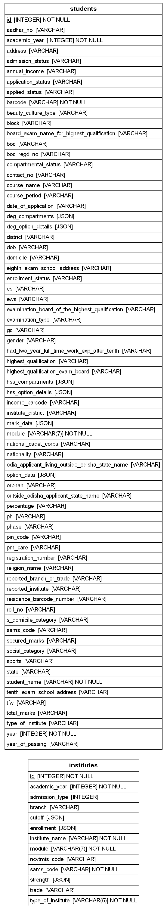

# SAMS

The **Student Academic Management System (SAMS)** is a data pipeline and analytics project designed to manage, process, and analyze large-scale student-level data across various academic programs in Odisha. This includes Industrial Training Institutes (ITI), Diploma programs, Post Diploma in Industrial Safety (PDIS), and Higher Secondary Schools (HSS).

---

## Prerequisites

Before using SAMS, ensure you have **Conda** installed and available in your system's PATH. You should also install `make`, if you want to make extracting and cleaning data single short commands. `make` is usually pre-installed on Unix based systems (if not, the default package managers such as `apt` and `brew` can easily install stable binaries). If you're on Windows, installing `make` takes a little bit more work. 

---

## Setting up the Environment

To set up the development environment:

1. Open a terminal and navigate to the root directory of the SAMS repository.
2. Run the following command to create the Conda environment:

   ```bash
   make create_env
   ```

   This will create a new Conda environment named `skills`.

3. Activate the environment:

   ```bash
   conda activate skills
   ```

---

## Running the Project

To build the dataset and initialize the database:

```bash
make sams_db
```

This will load and transform raw inputs into a structured format stored in a local SQLite database stored at `/data`

Next, to produce cleaned intermediate outputs, type
```bash
make clean_data
```

---

## Database Structure

SAMS is built on a **SQLite3** database that contains two main tables:

- **`students`**: Holds information for each student, such as their unique ID (`barcode`), gender, academic year, admission and enrollment status. Some fields also store extra details in JSON format (e.g., admission options or compartment subjects).

- **`institutes`**: Contains data about each institute, including its name, type, location, student strength, and cutoff marks.

Each student record includes a `module` field to indicate whether the student belongs to ITI, HSS, Diploma, or PDIS. These two tables are connected through fields like `barcode` or `sams_code`.

---

## Database Schema

The diagram below shows how the tables are structured and related:




---


## ITI Module Summary

This dataset contains **application-level data** submitted through the **SAMS Odisha portal** for **Industrial Training Institutes (ITI)** from **2017 to 2024**.  
Each row represents **one application**. A single student may apply to multiple trades or institutes, resulting in multiple application records linked to the same student.

---

### Variable Descriptions

| Variable              | Description                                                                 |
|-----------------------|-----------------------------------------------------------------------------|
| `barcode`             | Encrypted student ID (SHA‑256)                                              |
| `gender`              | Student gender (`Male` / `Female`)                                          |
| `academic_year`       | Application year (2017–2024)                                                |
| `course_period`       | Duration of the course (e.g. `2 Years`)                                     |
| `total_marks`         | Total maximum marks                                                         |
| `secured_marks`       | Marks obtained by the student                                               |
| `percentage`          | Calculated percentage based on total and secured marks                      |
| `social_category`     | Category (`GEN`, `OBC/SEBC`, `SC`, `ST`)                                    |
| `state` / `district`  | Student’s home state and district                                           |
| `option_details`      | JSON array of options: {`Option_No`, `Applied Institute`, `Applied Trade`, `Reported Institute`, etc.} |

> **ITI applications (2017–2024):** Started at 34,654 in 2017 and rose to 83,958 in 2024, peaking at 92,085 in 2023.

---

### 1. Overview

- **Total Records:** 2,218,951  
- **Total Unique Students:** ~573,518  
- **Academic Years Covered:** 2017–2024  
- **Average Applications per Student:** ~4.63  

#### Key Missing Fields (by count):
- `course_period`, `reported_institute`, `reported_branch_or_trade`, `institute_district`, `type_of_institute`: 1,016,232 each  
- `Phase`, `Option_No`, `Status`: 280,524 each 

---

### 2. Admission & Enrollment

- **`admission_status`** reflects whether an application led to a seat being offered.  
  Common values include `Yes`, `No`, or descriptive entries like:
  - `"TC Taken: Institute - ITI Rourkela, Trade - Fitter"`
- **`enrollment_status`** indicates whether the applicant actually joined the institute.  
  It typically has values: `Yes` or `No`.

> These fields allow analysis of the student journey from application to admission to actual enrollment.

---

### 3. Application Preferences (Option_No)

| Variable     | No. of Students | Mean | 25% | 50% | 75% |
|--------------|--------------|------|-----|-----|-----|
| `Option_No`  | 1,938,427    | 4.63 | 2.0 | 4.0 | 5.0 |

> Students generally list 4–5 on average preferences when applying.

---

### 4. Key Categorical Attributes


1. Demographic Patterns: `gender`, `social_category`, `highest_qualification`
2. Regional Distribution: `state`, `district`
3. Application Behavior: `course_period`, `reported_institute`, `Phase`, `Option_No`, `Status`


---

## HSS Application Module Summary

This dataset represents **application-level admission records** submitted by students applying to Higher Secondary Schools (HSS) via the SAMS Odisha portal between 2018 and 2024.  
Each row corresponds to **a single admission option** selected by a student which means one student can have multiple rows depending on how many options they selected.

---

### Source & Structure

This dataset was constructed by expanding two **JSON string variables** embedded in the student-level dataset:

- **`hss_option_details`** – Admission preferences like institute, stream, phase, admission status, etc.  
- **`hss_compartments`** – Subject-wise marks for compartmental students, including fail/pass marks.

> After exploding these JSON strings, the data grows from **3.4 million student records** to **18.3 million application-level rows**.

---

### Dataset Overview

- **Total Applicants (Base Data):** 3,453,401  
- **Total Application Options (Exploded Rows):** 18,379,224  
- **Academic Years Covered:** 2017–2024  
- **Compartment Info Present In:** 110,251 rows (~0.6%)

#### Sparse or Missing Fields

- `Stream`, `ReportedInstitute`, `SAMSCode`: 23,471 missing (0.13%)  
- `COMPSubject`, `COMPFailMark`, `COMPPassMark`: Present only for 0.6% of records (compartmental students)

---

### Variable Descriptions

| Variable                | Description                                                                 |
|-------------------------|-----------------------------------------------------------------------------|
| `barcode`               | Encrypted student ID (SHA‑256)                                              |
| `academic_year`         | Year of application (2017–2024)                                             |
| `gender`                | Student gender (Male / Female)                                              |
| `annual_income`         | Family income bracket (e.g. `0–1,50,000 INR`)                               |
| `social_category`       | Student category (GEN, OBC/SEBC, SC, ST)                                    |
| `state` / `district`    | Student’s residence location                                                |
| `total_marks`           | Total maximum marks (typically 600)                                         |
| `secured_marks`         | Marks obtained by the student                                               |
| `percentage`            | Calculated percentage based on total and secured marks                     |
| `compartmental_status`  | Whether the student had compartments (`Yes` / `No`)                         |
| `hss_option_details`    | JSON array with details like Option No, Institute, Stream, Admission Status |
| `hss_compartments`      | JSON array with COMPSubject, COMPFailMark, COMPPassMark                     |

---

### Compartmental Marks Summary (110K rows)

| Variable        | No. of Students | Mean  | Median | Std Dev | 25%  | 75%  |
|-----------------|--------------|-------|--------|---------|------|------|
| COMPFailMark    | 110,251      | 21.53 | 21.0   | 9.58    | 17.0 | 26.0 |
| COMPPassMark    | 110,251      | 38.72 | 33.0   | 19.31   | 30.0 | 40.0 |

---

### Most Common Admission Attributes

1. Academic Streams & Preferences: `Stream`, `TypeofInstitute`, `Phase`, `Year`, `OptionNo`
2. Institute Location Details: `InstituteDistrict`, `InstituteBlock`
3. Compartment Information: `COMPSubject`

---

###  Additional Notes:

- This is an **application-level** dataset, each row represents one application or admission option.
- A single student (`barcode`) may appear multiple times,it has to be unique, reflecting multiple choices submitted.
- Exploded fields like `Option_No` (ITI) and `hss_option_details` (HSS) reveal student preferences and help analyze application patterns.
- In ITI data, missing `reported_institute` often implies **no selection** was made for that application.
- In the HSS dataset, only about 0.6% of students have `compartmental_status` records, indicating they were eligible to reappear in one or more subjects.
- Fields like `Phase`, `TypeofInstitute`, and `Stream` are important to understanding **seat allocation**, **preference behavior**, and **institutional demand**.
- These datasets are valuable for broader research in **allocation efficiency**, **student decision-making**, **supply-demand analysis**, and **regional access to education**.


---

## ITI Pipleine:

```mermaid
flowchart LR

  subgraph "SAMS Database"
    A1[iti_raw]
    A2[diploma_raw]
    A3[iti_institutes_raw]
    A4[diploma_institutes_raw]
    A5[sams_address_raw_df]
  end

  %% Enrollment
  A1 --> B1[iti_enrollment]
  A2 --> B2[diploma_enrollment]

  %% Address cleaning & geocoding
  A5 --> C1[sams_address_clean_df]
  C1 --> D1[geocodes_df]
  D1 --> E1[geocoded_iti_enrollment]
  D1 --> E2[geocoded_diploma_enrollment]

  %% ITI marks, cutoffs, and non‑geocoded students
  B1 --> F1[iti_marks]
  B1 --> F2[save_nongeocoded_iti_students]
  F1 --> G1[iti_marks_and_cutoffs]
  G1 --> H1[save.iti_marks_and_cutoffs]

  %% Diploma marks, cutoffs, and non‑geocoded students
  B2 --> I1[diploma_marks]
  B2 --> I2[save_nongeocoded_diploma_students]
  I1 --> J1[diploma_marks_and_cutoffs]
  J1 --> K1[save.diploma_marks_and_cutoffs]

  %% Institutes pipelines
  A3 --> L1[iti_institutes_enrollments]
  A3 --> L2[iti_institutes_cutoffs]
  A3 --> L3[iti_institutes_strength]
  L1 & L2 & L3 --> M1[save_interim_iti_institutes]

  A4 --> N1[diploma_institutes_enrollments]
  A4 --> N2[diploma_institutes_strength]
  N1 & N2 --> O1[save_interim_diploma_institutes]

  %% Vacancies
  L2 --> P1[iti_vacancies]
  P1 --> Q1[save.iti_vacancies]


