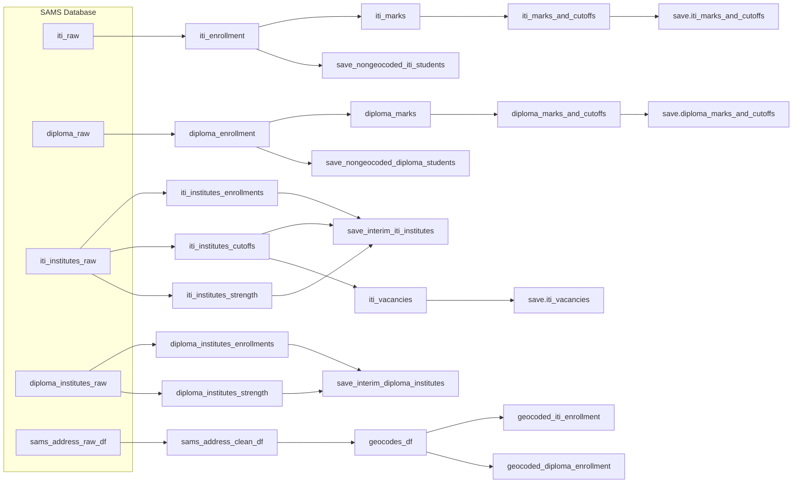

# SAMS

The **Student Academic Management System (SAMS)** is an online application system for students in Odisha to apply to higher secondary, tertiary, and vocational education programs in the state. This project collects, cleans, and analyses the data from this online application system to understand trends and patterns in the post-secondary educational landscape of Odisha.


## Prerequisites

In order to build the project, you need to have **Conda** installed and available in your system's PATH. You should also install `make`, if you want to make extracting and cleaning data single short commands. `make` is usually pre-installed on Unix based systems (if not, the default package managers such as `apt` and `brew` can easily install stable binaries). If you're on Windows, installing `make` takes a little bit more work. We recommend you use a Windows Subsystem for Linux (WSL) environment to run the project.


### Setting up the Environment

To set up the development environment:

1. Open a terminal and navigate to the root directory of the SAMS repository.
2. Run the following command to create the Conda environment:

   ```bash
   make create_env
   ```

   This will create a new Conda environment named `skills`.

3. Activate the environment:

   ```bash
   conda activate skills
   ```

---

## Running the Project

To build the dataset and initialize the database:

```bash
make sams_db
```

This will load and transform raw inputs into a structured format stored in a local SQLite database stored at `/data`

Next, to produce cleaned intermediate outputs, type
```bash
make clean_data
```

---

## Database Structure

SAMS is built on a **SQLite3** database that contains two main tables:

- **`students`**: Holds information for each student, such as their unique ID (`barcode`), gender, academic year, admission and enrollment status. Some fields also store extra details in JSON format (e.g., applications to various institutions). Each student record includes a `module` field to indicate whether the student belongs to ITI, HSS, Diploma, or PDIS.


- **`institutes`**: Contains data about each institute, including its name, type, location, student strength, and cutoff marks. Institute  data is only available for the vocational modules i.e. ITI, Diploma, and PDIS.

The two tables are connecting using the `sams_code` variable that is a unique ID for every institution.


### Database Schema

The diagram below shows how the tables are structured and related:


---

## Data cleaning 

The cleaning pipeline takes the raw data contained in a single SQLite database file in `/data` and runs it through a preprocessing pipeline, which defines a directed acyclic graph (DAG) for the various modules (ITI, Diploma, PDIS, HSS). The outputs are parquet files that are named using a `'module'_'features'.pq` style. For example, data on ITI enrollments is in a file called `iti_enrollments.pq`. 

The figure below shows the preprocessing / cleaning DAG for the ITI and Diploma modules for both students and institutes.

### ITI and Diploma DAG




### HSS DAG

---

## Student Admission Summary

This summary presents the number of students who applied through the SAMS Odisha portal across four educational modules: Industrial Training Institutes (ITI), Diploma, Post Diploma in Industrial Safety (PDIS), and Higher Secondary Schools (HSS), and the number of applications they submitted each year.

### 1. Overview of Key Variables

The list below shows some of the main variables in the database to provide a general understanding of the data structure.

| Variable                | Description                                                                 |
|-------------------------|-----------------------------------------------------------------------------|
| `aadhar_no`             | Encrypted Aadhar number (SHA‑256 key used)                                  |
| `barcode`               | application ID                                                              |
| `academic_year`         | Academic year of application (2017–2024)                                    |
| `state` / `district`    | Student’s home state and district                                           |
| `compartmental_status`  | Whether the student had compartmental subjects (`Yes` / `No`)               |
| `admission_status`      | Whether a seat was offered (`Yes` / `No`)                                   |
| `enrollment_status`     | Whether the student enrolled (`Yes` / `No`)                                 |
| `option_details`        | JSON array of an ITI or Diploma student's choices (`Option_No`, `Applied Institute`, `Applied Trade`, `Reported Institute`, etc.) |
| `hss_option_details`    | JSON array of an HSS student’s choices (`OptionNo`, `Institute`, `Stream`, `Admission Status`, etc.) |
| `hss_compartments`      | JSON array with `COMPSubject`, `COMPFailMark`, `COMPPassMark`               |
| `sams_code`             | Unique code for each institutes                                             |
| `type_of_institute`     | Type of institution (`Government`, `Private`, etc.)                         |
| `strength`              | Total seats available for a specific trade and module                       |
| `cutoff`                | Minimum required percentage ````````````````````````````                    |


### 2. Students and applications

#### 2.1. Number of students by module and year

This table shows how many unique students were present in each module (ITI, Diploma, PDIS, HSS) for each academic year.

| Academic Year |   ITI   | Diploma | PDIS |   HSS    |   DEG   | Total Students  |
|:-------------:|--------:|--------:|-----:|---------:|--------:|----------------:|
| 2017          |  27,337 |       0 |    0 |       0  |       0 |          27,337 |
| 2018          |  70,613 |  52,530 |    0 | 367,581  | 202,946 |         693,670 |
| 2019          |  64,148 |  44,080 |    0 | 355,308  | 198,918 |         662,454 |
| 2020          |  67,412 |  56,533 |  916 | 341,822  | 190,598 |         657,281 |
| 2021          |  81,948 |  59,278 |  874 | 375,368  | 249,005 |         766,473 |
| 2022          |  74,104 |  78,196 |1,187 | 417,040  | 255,005 |         825,532 |
| 2023          |  92,085 |  79,700 |1,287 | 419,135  | 234,901 |         827,108 |
| 2024          |  83,958 |  81,789 |1,453 | 473,097  | 260,542 |         900,839 |


#### 2.2 Number of applications per student

The following tables show  summaries of the number of applications submitted per student in each academic year.

Each table includes:

- **Number of Students**: Count of unique students who submitted at least one application that year
- **Mean**: Average number of applications per student
- **Std Dev**: Standard deviation
- **25th / Median / 75th**: Percentiles of number of applications per student


##### 2.2.1 All Modules (Combined)

| Academic Year | Number of Students | Mean | Std Dev | 25th | Median | 75th |
|:-------------:|-------------------:|-----:|--------:|-----:|-------:|-----:|
| 2017          | 27,337             | 5.24 | 76.48   | 2.0  | 4.0    | 6.0  |
| 2018          |490,724             | 3.00 | 48.71   | 0.0  | 1.0    | 3.0  |
| 2019          |463,536             | 3.85 | 65.61   | 0.0  | 1.0    | 5.0  |
| 2020          |466,683             | 2.78 |  4.68   | 0.0  | 1.0    | 5.0  |
| 2021          |517,468             | 3.09 |  4.68   | 0.0  | 1.0    | 5.0  |
| 2022          |570,527             | 3.35 |  5.15   | 0.0  | 1.0    | 5.0  |
| 2023          |592,207             | 3.67 |  4.96   | 0.0  | 2.0    | 5.0  |
| 2024          |640,297             | 4.03 |  5.57   | 1.0  | 2.0    | 5.0  |


##### 2.2.2 ITI (Industrial Training Institutes) 


| Academic Year | Number of Students | Mean | Std Dev | 25th | Median | 75th |
|:-------------:|-------------------:|-----:|--------:|-----:|-------:|-----:|
| 2017          | 27,337             | 5.24 | 76.48   | 2.0  | 4.0    | 6.0  |
| 2018          | 70,613             | 2.41 |  4.64   | 0.0  | 0.0    | 3.0  |
| 2019          | 64,148             | 3.59 |  4.49   | 0.0  | 5.0    | 5.0  |
| 2020          | 67,412             | 2.47 |  3.90   | 0.0  | 0.0    | 5.0  |
| 2021          | 81,948             | 3.16 |  3.93   | 0.0  | 0.0    | 5.0  |
| 2022          | 74,104             | 3.60 |  4.64   | 0.0  | 5.0    | 5.0  |
| 2023          | 92,085             | 3.73 |  4.88   | 0.0  | 5.0    | 5.0  |
| 2024          | 83,958             | 4.27 |  5.46   | 0.0  | 5.0    | 5.0  |


##### 2.2.3 Diploma

| Academic Year | Number of Students | Mean | Std Dev | 25th | Median | 75th |
|:-------------:|-------------------:|-----:|--------:|-----:|-------:|-----:|
| 2018          | 52,530             | 3.60 | 73.30   | 1.0  | 1.0    | 4.0  |
| 2019          | 44,080             | 3.97 |101.25   | 1.0  | 1.0    | 4.0  |
| 2020          | 56,533             | 3.02 |  5.17   | 1.0  | 1.0    | 3.0  |
| 2021          | 59,278             | 2.80 |  5.10   | 1.0  | 1.0    | 3.0  |
| 2022          | 78,196             | 2.94 |  5.18   | 1.0  | 1.0    | 3.0  |
| 2023          | 79,700             | 3.35 |  4.43   | 1.0  | 2.0    | 4.0  |
| 2024          | 81,789             | 3.51 |  4.79   | 1.0  | 2.0    | 5.0  |

##### 2.2.4 HSS (Higher Secondary Schools) 


| Academic Year | Number of Students | Mean | Std Dev | 25th | Median | 75th |
|:-------------:|-------------------:|-----:|--------:|-----:|-------:|-----:|
| 2018          | 367,553            | 6.02 | 1.48    | 5.0  | 5.0    | 5.0  |
| 2019          | 353,042            | 5.71 | 1.12    | 5.0  | 5.0    | 5.0  |
| 2020          | 341,761            | 6.52 | 1.86    | 5.0  | 5.0    | 5.0  |
| 2021          | 375,280            | 6.83 | 1.82    | 5.0  | 5.0    | 5.0  |
| 2022          | 416,964            | 7.07 | 2.63    | 5.0  | 5.0    | 6.0  |
| 2023          | 419,054            | 7.06 | 3.16    | 5.0  | 5.0    | 6.0  |
| 2024          | 473,009            | 6.03 | 2.77    | 5.0  | 5.0    | 6.0  |


#### 2.2.5 DEG ( HIgher Degree)

| Academic Year | Number of Students |  Mean  | Std Dev | 25th | Median | 75th |
|:-------------:|-------------------:|-------:|--------:|-----:|-------:|-----:|
| 2018          |            202,946 |   7.28 |    4.24 |  5.0 |    5.0 |  9.0 |
| 2019          |            198,918 |   7.98 |    4.25 |  5.0 |    6.0 | 10.0 |
| 2020          |            190,598 |   7.98 |    4.27 |  5.0 |    6.0 | 10.0 |
| 2021          |            249,005 |  11.34 |    7.12 |  5.0 |   10.0 | 15.0 |
| 2022          |            255,005 |  10.72 |    5.38 |  5.0 |   10.0 | 14.0 |
| 2023          |            234,901 |  10.63 |    7.34 |  5.0 |    8.0 | 14.0 |
| 2024          |            260,542 |  10.10 |    7.68 |  5.0 |    7.0 | 12.0 |


